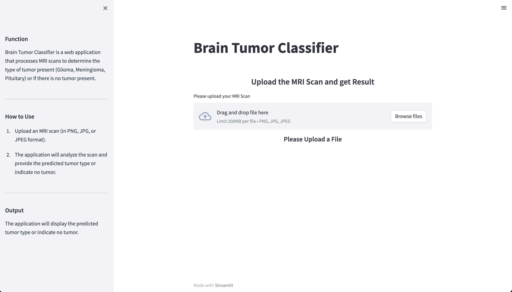

## 
# Brain Tumor Classifier
Brain Tumor Classifier is a web application that processes MRI scans to determine the type of tumor present (Glioma, Meningioma, Pituitary) or if there is no tumor present.


## Function
Brain Tumor Classifier is designed to assist in the classification of brain tumors using convolutional neural networks. The application takes an MRI scan as input and applies a trained ResNet152V2 model to predict the type of tumor or indicate the absence of a tumor. It provides a quick and convenient way to analyze MRI scans and obtain tumor classification results.


## How to Use
1. Upload an MRI scan (in PNG, JPG, or JPEG format).
2. The application will analyze the scan and provide the predicted tumor type or indicate no tumor.


## Installation
1. Clone the repository:
```shell
git clone https://github.com/your-username/brain-tumor-classifier.git
```

2. Change into the project directory: 
```shell
cd brain-tumor-classifier
```

3. Install the required dependencies: 
```shell
pip install -r requirements.txt
```


## Dataset
The dataset used for training the brain tumor classifier is available on Kaggle. You can download it from the following link:

[Brain Tumor Classifier Dataset on Kaggle](https://www.kaggle.com/datasets/masoudnickparvar/brain-tumor-mri-dataset)


## AI Model
To run the Brain Tumour Classifier, you will need to download the pretrained ResNet152V2 model in .h5 format. You have two options to obtain the model:


### Option 1: Running Jupyter Notebook
1. Ensure you have Jupyter Notebook installed. If not, you can install it using the following command:
```shell
   pip install jupyter notebook
```
2. Open the reset.ipynb Jupyter Notebook.
3. Run the notebook cells sequentially by clicking on Cell and selecting Run All.
4. After running all the cells, the resnet.h5 file will be generated in the same directory as the notebook.

Make sure to place the resnet.h5 file in the same directory as the Streamlit app (app.py) before running the application.

### Option 2: Download from Mega
1. Access the Mega link to download the pretrained model by clicking [here](https://mega.nz/folder/46QwiSCY#kTgCWkBJFQ1durISD71zqQ).
2. Click on the download button to save the `resnet.h5` file to your local machine.

Make sure to place the `resnet.h5` file in the same directory as the Streamlit app (`mainapp.py`) before running the application.

## Running the App
Run the Streamlit application using the following command:

```shell
streamlit run mainapp.py
```
The application will be available in your browser at http://localhost:8501.

